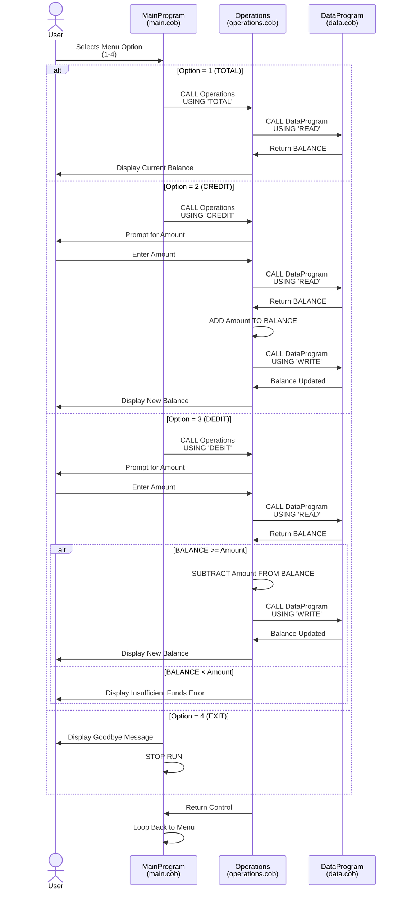

# Student Account Management System - COBOL Implementation

## Overview

This is a legacy COBOL-based Student Account Management System designed to handle basic account operations for student accounts. The system provides a menu-driven interface for managing account balances with support for viewing balances, crediting accounts (adding funds), and debiting accounts (withdrawing funds).

---

## COBOL Files Documentation

### 1. **main.cob** - Main Program Entry Point
**Program ID:** `MainProgram`

#### Purpose
Serves as the primary entry point for the Account Management System. Implements the main menu loop and orchestrates user interactions.

#### Key Functions
- **Menu Display:** Presents a user-friendly menu with four options (1-4)
- **User Input Handling:** Accepts user choices and routes them to appropriate operations
- **Program Flow Control:** Uses a continuous loop until user selects exit option
- **Operation Routing:** Calls the `Operations` program with the appropriate operation type

#### Key Data Variables
- `USER-CHOICE`: Stores the numeric menu selection (1-4)
- `CONTINUE-FLAG`: Controls the main loop execution (YES/NO)

#### Menu Options
1. **View Balance** - Display current account balance
2. **Credit Account** - Add funds to the account
3. **Debit Account** - Withdraw funds from the account
4. **Exit** - Terminate the program

#### Business Rules
- Invalid menu selections display an error message and redisplay the menu
- Program terminates gracefully when user selects option 4

---

### 2. **data.cob** - Data Storage Module
**Program ID:** `DataProgram`

#### Purpose
Manages persistent storage and retrieval of student account balance data. Acts as a data access layer for account information.

#### Key Functions
- **Balance Storage:** Maintains account balance in persistent storage
- **READ Operation:** Retrieves the current stored balance
- **WRITE Operation:** Updates and persists the account balance to storage

#### Key Data Variables
- `STORAGE-BALANCE`: Stores the account balance (format: 9(6)V99, range: 0-999,999.99)
- `OPERATION-TYPE`: Specifies the operation to perform (READ or WRITE)
- `BALANCE`: Linkage variable for receiving/sending balance data

#### Initial State
- Default starting balance: **$1,000.00** for new accounts

#### Business Rules
- Balance is stored with precision to two decimal places (currency format)
- READ operations return the current balance without modification
- WRITE operations update the stored balance for persistence
- All balance values are non-negative (stored as unsigned numeric)

---

### 3. **operations.cob** - Business Logic Operations
**Program ID:** `Operations`

#### Purpose
Implements the core business logic for account operations including balance inquiries, credit transactions, and debit transactions with validation.

#### Key Functions

##### **TOTAL (View Balance)**
- Reads the current balance from DataProgram
- Displays the current account balance to the user
- No data modification occurs

##### **CREDIT (Add Funds)**
- Prompts user to enter the amount to credit
- Reads current balance from DataProgram
- Adds the credit amount to the current balance
- Persists the updated balance to DataProgram
- Displays confirmation message with new balance

##### **DEBIT (Withdraw Funds)**
- Prompts user to enter the amount to debit
- Reads current balance from DataProgram
- Validates sufficient funds availability before processing
- If sufficient funds exist:
  - Subtracts the debit amount from the balance
  - Persists the updated balance to DataProgram
  - Displays confirmation message with new balance
- If insufficient funds:
  - Displays error message
  - Does not modify the balance

#### Key Data Variables
- `OPERATION-TYPE`: Type of operation to perform (TOTAL, CREDIT, or DEBIT)
- `AMOUNT`: User-entered transaction amount
- `FINAL-BALANCE`: Current account balance (format: 9(6)V99)

#### Business Rules

##### General Rules
- All amounts are handled with currency precision (two decimal places)
- Balance maximum capacity: $999,999.99
- All transactions are processed sequentially

##### Credit Rules
- Accepts any positive amount
- No upper limit validation (assumes business processes handle this)
- Immediately updates and persists account balance

##### Debit Rules
- **Insufficient Funds Check:** Validates that current balance >= debit amount before processing
- **Overdraft Prevention:** Prevents debit transactions when balance is insufficient
- **Atomic Updates:** Transaction only completes if funds are available
- Only processes debit if validation passes; otherwise displays "Insufficient funds" message

##### Account Status
- Initial student account balance: $1,000.00
- Balance cannot go negative through normal debit operations
- All operations are immediate (no pending transaction status)

---

## System Architecture

```
User Input (main.cob)
        |
        v
    Menu Selection
        |
        +-> TOTAL    --> Operations.cob --> DataProgram.cob (READ)
        |
        +-> CREDIT   --> Operations.cob --> DataProgram.cob (READ/WRITE)
        |
        +-> DEBIT    --> Operations.cob --> DataProgram.cob (READ/WRITE)
        |
        +-> EXIT     --> Program Termination
```

---

## Usage Example

```
--------------------------------
Account Management System
1. View Balance
2. Credit Account
3. Debit Account
4. Exit
--------------------------------
Enter your choice (1-4): 1
Current balance: 1000.00

Enter your choice (1-4): 2
Enter credit amount: 500.00
Amount credited. New balance: 1500.00

Enter your choice (1-4): 3
Enter debit amount: 200.00
Amount debited. New balance: 1300.00

Enter your choice (1-4): 4
Exiting the program. Goodbye!
```

---

## Technical Specifications

- **Language:** COBOL (Legacy)
- **Program Type:** Interactive console-based application
- **Data Format:** Binary numeric with fixed decimal precision (9(6)V99)
- **Initial Balance:** $1,000.00
- **Currency Precision:** 2 decimal places
- **Maximum Balance:** $999,999.99

---

## Notes for Modernization

This system is a candidate for modernization due to:
1. Legacy COBOL implementation requiring specialized skills
2. Limited error handling and user experience features
3. No audit trail or transaction logging
4. No multi-user support or concurrent access handling
5. Console-based interface limited to single terminal sessions
6. Hard-coded initial balance value
7. No data persistence mechanism beyond in-memory storage during program execution

---

## Data Flow Sequence Diagram

The following Mermaid sequence diagram illustrates the typical data flow for account operations (Credit/Debit):



### Sequence Diagram Explanation

**Main Flow:**
1. User selects a menu option (1-4)
2. MainProgram calls Operations with the operation type
3. Operations module processes the request based on type
4. DataProgram handles all persistence (READ/WRITE operations)
5. Response is displayed to the user
6. Control returns to MainProgram for next iteration

**Data Operations:**
- **READ**: Retrieves current balance from persistent storage
- **WRITE**: Updates and persists new balance to storage

**Validation Flow (DEBIT only):**
- Balance is checked against debit amount
- Transaction only proceeds if sufficient funds exist
- User receives appropriate confirmation or error message

---

## Related Files

- [main.cob](../src/cobol/main.cob) - Main program implementation
- [data.cob](../src/cobol/data.cob) - Data module implementation
- [operations.cob](../src/cobol/operations.cob) - Operations module implementation
